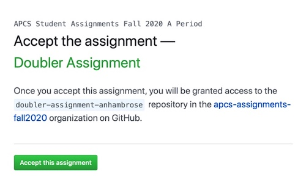
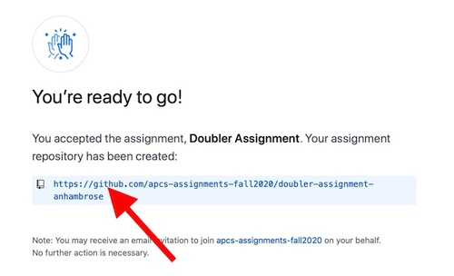

# Create an Assignment Repo

1) Open the URL in your browser to accept the assignment and create an assignment repo.

2) The initial assignment will require you to authorize GitHub Classroom (this will be a one-time process). 
Click on `Authorize github`:
    

3) Click on `Accept this assignment`:
   

4) After the assignment repo is created, click on the URL and go to assignment repo on Github:
   

