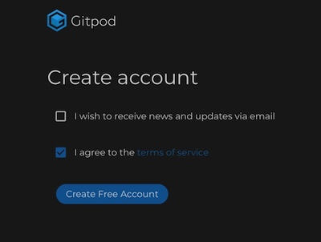
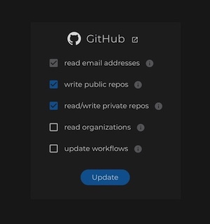

# Setup Gitpod 

1) Go to [Gitpod](https://www.gitpod.io) at https://www.gitpod.io  

2) Create an account by clicking on the `Log In` button in the upper right hand corner:
    

3) Click on `GitHub`:
    

4) Click on `Authorize gitpod-io`:
    

5) Check `I agree to the terms of service` and then click on `Create Free Account`:
    

6) Click on the user avatar in the upper right hand corner and then click on `Access Control`: 
    

7) Check the first 3 boxes and then click `Update`:
    

8) Click on `Authorize gitpod-io`:
  

9) If you are using [Chrome](https://www.google.com/chrome/) or [Firefox](https://www.mozilla.org/en-US/firefox/new/), 
you can install the [Gitpod Browser Extension](https://www.gitpod.io/docs/browser-extension/).