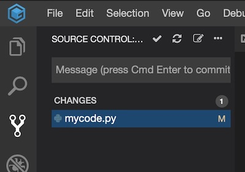
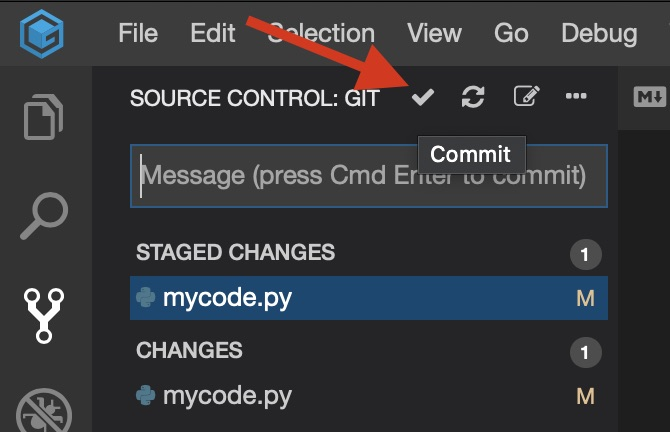
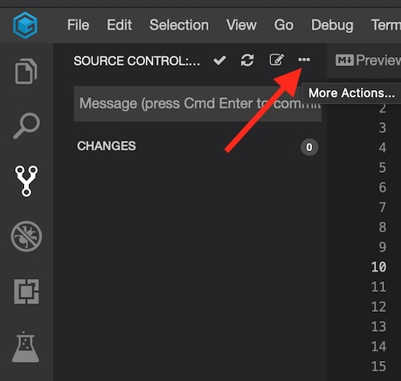
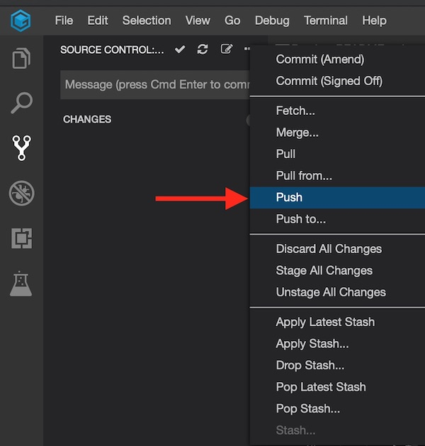

# Submit completed assignment to Github

1) After getting the tests to run successfully, check-in your work to Github.

2) Go to the Source Control view by selecting `View -> Source Control` or click 
on the Source Control icon on the left panel:
    

3) All modified files will appear in the `Changes` section (with an M for modified):
    

4) Mouseover the right of `CHANGES` and then click on the `Stage All Changes` 
plus icon to move the modfied files to the `Staged Changes` section:
    

5) Enter a commit message in the `Message` input box and then 
click on the checkmark to commit the modified file to the local git repo:
    

6) Mouseover to the right of `SOURCE CONTROL...` and then click on the `More Actions...` 
dash-dash-dash icon to display the Git context menu:
    

7) Click on the `Push` option on the Git context menu to push your changes to Github:
    
